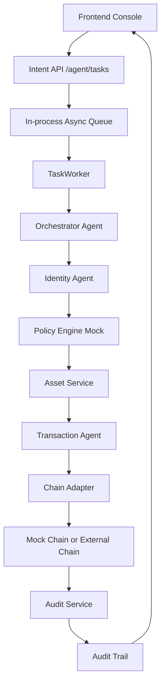

# AI Agent 原生联盟链 Tokenization MVP

这是一个面向参赛演示和工程验证的 **AI Agent 原生联盟链资产 Tokenization 系统**。

项目的核心思想是：外部用户、机构或业务系统只提交目标、约束和授权信号；系统内部的 LP 认购基金份额、GP 投资项目、算力 Token 收益审计、链上交易、策略校验和审计留痕全部由 AI Agent 通过受控工具执行。联盟链负责可信状态、交易证据和审计关联，链下服务负责任务编排、身份模型、策略 mock、资产索引和审计查询。

当前版本已经不是单纯文档，而是一个可运行 MVP：

```text
前端操作台
  -> POST /agent/tasks
  -> 进程内异步任务队列
  -> Orchestrator Agent
  -> Identity Agent
  -> Policy Engine Mock
  -> Asset Service
  -> Chain Adapter
  -> Audit Service
  -> 查询资产状态和审计轨迹
```

## 当前状态

本项目当前定位是 **可演示 MVP**，不是生产级完整产品。

已经具备：

- 可运行 Python 后端，无第三方依赖。
- 无依赖静态前端操作台。
- `AgentTask` 任务模型。
- 进程内异步任务队列和后台 worker。
- 机构和用户身份模型。
- Identity Agent 校验。
- Policy Engine mock。
- KYC/AML profile、持牌机构 registry、法律权益映射、托管签名 mock、oracle attestation。
- `FundShareToken`、`PortfolioEquityRWA`、`ComputePowerToken` 三类资产业务闭环。
- 可替换 Chain Adapter，默认使用本地 mock chain。
- Audit trail 查询，包含 audit logs、tool calls、transactions、chain events。
- 完整技术方案、DDL、OpenAPI、合约伪代码、Agent spec、service skeleton 和自定义 skill。

还不是生产级产品的原因：

- 真实联盟链节点尚未接入，但已有 mock / HTTP Chain Adapter 边界。
- 任务队列仍是进程内实现，不是 Kafka、Celery、RabbitMQ 或 NATS。
- Policy Engine 仍是 mock 规则。
- KYC、AML、黑名单、额度、监管报送已有数据模型和工具调用，但仍是 demo 数据。
- KMS/HSM 或真实钱包签名尚未接入，但已有 custody wallet / signature request mock。
- 前端是 demo console，不是完整运营后台。

## 快速开始

项目使用 Python 标准库和 SQLite，不需要安装依赖。

### 1. 启动后端和前端

```bash
python3 mvp/app.py --host 127.0.0.1 --port 8080
```

打开前端：

```text
http://127.0.0.1:8080/
```

健康检查：

```bash
curl http://127.0.0.1:8080/health
```

### 2. 运行端到端 Demo

```bash
python3 mvp/demo.py
```

demo 会自动启动一个临时本地服务和临时 SQLite 数据库，然后执行：

1. LP `alice` 创建 `subscribe_fund_share` AgentTask。
2. Identity Agent 校验 LP KYC 和 GP/Manager 机构状态。
3. Policy Engine mock 审批通过。
4. Chain Adapter 确认 `issueFundShareToken` 交易，生成 `FundShareToken`。
5. GP `issuer_A` 创建 `invest_portfolio_equity` AgentTask。
6. Chain Adapter 确认 `issuePortfolioEquityRWA` 交易，生成 `PortfolioEquityRWA`。
7. 算力运营方 `custodian_A` 创建 `record_compute_revenue` AgentTask。
8. Chain Adapter 确认 `recordComputeRevenue` 交易，生成或更新 `ComputePowerToken`。
9. 查询三类资产审计轨迹，返回 audit logs、tool calls、transactions、chain events。

成功输出里会看到类似结果：

```text
fund_subscription_task.status = succeeded
portfolio_investment_task.status = succeeded
compute_revenue_task.status = succeeded
fund_share_asset.asset_type = FundShareToken
portfolio_equity_asset.asset_type = PortfolioEquityRWA
compute_power_asset.asset_type = ComputePowerToken
```

## 前端功能

前端位于 `mvp/static/`，由同一个 Python 后端托管。

入口：

```text
http://127.0.0.1:8080/
```

前端支持：

- 查看当前后端健康状态。
- 查看默认机构和用户身份模型。
- 查看 KYC/AML、持牌机构、法律文件、权益映射、托管钱包、oracle attestation 和签名请求。
- 创建 LP 认购基金份额任务，发行 `FundShareToken`。
- 创建 GP 投资项目任务，发行 `PortfolioEquityRWA`。
- 创建算力 Token 收益审计任务，记录 `ComputePowerToken` 收益证据。
- 查看资产状态。
- 查看最近 AgentTask。
- 查看审计日志。
- 查看工具调用记录。
- 查看 mock chain events。
- 重置演示数据。

默认演示数据：

```text
Institutions:
  issuer_A
  regulator
  custodian_A

Users:
  alice
  bob
```

## 核心演示链路

```text
POST /agent/tasks
  -> 创建 AgentTask
  -> 写入 task_queue
  -> TaskWorker 异步领取任务
  -> Orchestrator Agent 生成执行计划
  -> Identity Agent 校验机构/用户身份
  -> Compliance Agent 调用 policy mock
  -> Asset Agent 准备资产操作
  -> Transaction Agent 通过 Chain Adapter 提交交易
  -> Mock Chain 生成 tx_hash、block_hash、chain event
  -> Audit Agent 写入审计证据
  -> AgentTask 变为 succeeded
```

## 系统架构



## 主要 API

### AgentTask

```text
POST /agent/tasks
GET  /agent/tasks/{task_id}
GET  /agent/tasks/{task_id}/audit
```

`POST /agent/tasks` 是系统的主要写入口。它只创建任务并入队，不直接修改资产状态。

当前 MVP 支持的核心 intent：

```text
subscribe_fund_share       LP 认购基金份额，生成 FundShareToken
invest_portfolio_equity    GP 投资项目，生成 PortfolioEquityRWA
record_compute_revenue     算力 Token 收益审计，生成或更新 ComputePowerToken
issue_asset                兼容旧版通用资产发行
transfer_asset             兼容旧版通用资产转让
```

### 资产查询和兼容入口

```text
GET  /assets/{asset_id}
POST /assets/issue
POST /assets/transfer
```

`POST /assets/issue` 和 `POST /assets/transfer` 是兼容接口。它们内部仍然会创建 `AgentTask`，不会绕过 Agent、policy、chain adapter 或 audit。

### 审计

```text
GET /audit/assets/{asset_id}
GET /transactions/{tx_hash}
```

审计结果包含：

- audit logs
- tool calls
- transaction records
- chain events

### 身份模型

```text
GET  /institutions
POST /institutions
GET  /users
POST /users
```

### 香港落地控制项

```text
GET /compliance/licenses
GET /compliance/kyc-aml
GET /legal/documents
GET /legal/rights
GET /legal/rights/{asset_id}
GET /custody/wallets
GET /custody/signatures
GET /oracle/attestations
```

这些接口当前使用 demo 数据，但已经进入 Agent 执行链路：

- `tool.compliance.verifyKycAml` 校验 KYC/AML 和持牌机构状态。
- `tool.legal.verifyRightsMapping` 校验 token 与法律文件、权益、转让限制的映射。
- `tool.custody.signTransaction` 生成托管签名请求和 mock KMS/HSM 签名哈希。
- `tool.oracle.verifyAttestation` 校验算力收益的外部证明数据。

当前实现中，Identity Agent 会检查：

- requester 是否存在。
- institution 是否 active。
- user 是否 active。
- user 是否 `kyc_status = verified`。
- issue 的 issuer 和 owner 是否有效。
- transfer 的 from/to 用户是否有效。
- fund share subscription 的 fund_manager 和 lp 是否有效。
- portfolio equity investment 的 fund_manager 是否有效。
- compute revenue record 的 beneficiary 是否已通过 KYC。
- 相关机构是否在 `licensed_institutions` 中有效。
- 相关主体是否在 `kyc_aml_profiles` 中 AML clear。

### 运维和状态

```text
GET  /health
GET  /queue/status
GET  /chain/status
POST /admin/reset
```

## Chain Adapter

系统已经把链交互封装成 `ChainAdapter`。

默认使用本地 mock adapter：

```bash
CHAIN_ADAPTER=mock python3 mvp/app.py
```

也可以切到外部 HTTP 链适配器：

```bash
CHAIN_ADAPTER=http CHAIN_RPC_URL=http://127.0.0.1:9000 python3 mvp/app.py
```

HTTP adapter 会调用：

```text
POST {CHAIN_RPC_URL}/transactions
```

外部链适配器至少需要返回：

```json
{
  "tx_hash": "0x...",
  "status": "confirmed",
  "block_height": 1,
  "block_hash": "0x..."
}
```

这样后续可以把 mock chain 替换成真实联盟链 SDK、网关服务或合约调用服务。

## 目录结构

```text
.
├── README.md
├── baseline.md
├── architecture.md
├── mvp/
│   ├── app.py
│   ├── demo.py
│   ├── README.md
│   └── static/
│       ├── index.html
│       ├── styles.css
│       └── app.js
├── engineering/
│   ├── agents/
│   │   └── agent-specs.md
│   ├── api/
│   │   └── openapi.yaml
│   ├── contracts/
│   │   └── AssetTokenization.pseudo.sol
│   ├── database/
│   │   └── schema.sql
│   └── services/
│       └── service-skeleton.md
├── services/
│   ├── agent-orchestrator/
│   ├── agent-runtime/
│   ├── tool-registry/
│   ├── policy-engine/
│   ├── asset-service/
│   ├── transaction-service/
│   ├── audit-service/
│   ├── chain-indexer/
│   ├── storage-service/
│   ├── monitor-service/
│   └── recovery-service/
└── skills/
    └── agentic-consortium-chain-baseline/
        ├── SKILL.md
        ├── agents/
        └── references/
```

## 关键文件说明

### 可运行 MVP

- `mvp/app.py`：后端主程序。包含 HTTP API、SQLite store、IdentityService、PolicyEngine、Orchestrator、TaskWorker、ChainAdapter、AuditService。
- `mvp/app.py` 同时包含当前 MVP 的 KYC/AML、licensed institution、legal rights、custody signing 和 oracle attestation mock 服务。
- `mvp/demo.py`：端到端自动演示脚本。
- `mvp/static/index.html`：前端操作台结构。
- `mvp/static/styles.css`：前端样式。
- `mvp/static/app.js`：前端 API 调用、任务轮询、资产和审计渲染。

### 技术方案

- `baseline.md`：原始 baseline 文档。
- `architecture.md`：完整系统技术方案。
- `engineering/database/schema.sql`：PostgreSQL 风格 DDL。
- `engineering/api/openapi.yaml`：OpenAPI 3.1 API 规范。
- `engineering/contracts/AssetTokenization.pseudo.sol`：资产 tokenization 合约伪代码。
- `engineering/agents/agent-specs.md`：Agent 角色、prompt 和交接规则。
- `engineering/services/service-skeleton.md`：服务拆分和职责边界。

### Skill

- `skills/agentic-consortium-chain-baseline/SKILL.md`：项目自定义 skill，用于生成、评审和扩展本项目的 AI Agent 原生联盟链方案。
- `skills/agentic-consortium-chain-baseline/references/baseline.md`：完整中文 baseline reference。

## 数据流示例

### LP 认购基金份额

```text
alice 提交 subscribe_fund_share
  -> task queued
  -> Identity Agent 验证 alice KYC 和 issuer_A 机构状态
  -> policy mock approved
  -> mock chain 生成 issueFundShareToken tx
  -> fund-share-hkpe-alice-001 asset_type = FundShareToken
  -> fund-share-hkpe-alice-001 owner = alice
  -> audit evidence 写入
```

### GP 投资项目

```text
issuer_A 提交 invest_portfolio_equity
  -> task queued
  -> Identity Agent 验证 issuer_A 机构状态
  -> policy mock approved
  -> mock chain 生成 issuePortfolioEquityRWA tx
  -> portfolio-equity-aicomp-001 asset_type = PortfolioEquityRWA
  -> portfolio-equity-aicomp-001 owner = HK_PE_FUND_I
  -> audit evidence 写入
```

### 算力 Token 收益审计

```text
custodian_A 提交 record_compute_revenue
  -> task queued
  -> Identity Agent 验证 custodian_A 机构状态和 bob KYC
  -> policy mock approved
  -> mock chain 生成 recordComputeRevenue tx
  -> compute-token-aicomp-001 asset_type = ComputePowerToken
  -> compute-token-aicomp-001 owner = bob
  -> audit evidence 写入
```

## 适合怎么展示

建议演示顺序：

1. 打开 `http://127.0.0.1:8080/`。
2. 展示机构和用户身份模型。
3. 点击“创建认购任务”，展示 `FundShareToken` 和 LP 认购审计。
4. 点击“创建投资任务”，展示 `PortfolioEquityRWA` 和 GP 投资审计。
5. 点击“记录收益审计”，展示 `ComputePowerToken` 和算力收益审计。
6. 展示每个任务都有 policy、tool call、tx hash、chain event 和 evidence hash。
7. 打开 `architecture.md` 或 `engineering/` 说明可扩展到真实联盟链和生产服务。

## 项目亮点

- Agent-native：资产操作不是直接 API 改状态，而是通过 AgentTask 执行。
- 可审计：每次操作都有 tool call、tx hash、chain event 和 evidence hash。
- 合规控制可见：KYC/AML、持牌机构、法律权益映射、托管签名和 oracle 证明都进入执行轨迹。
- 可替换链适配：mock chain 可以替换成真实联盟链网关。
- 工程路径清晰：既有可运行 MVP，也有 DDL、OpenAPI、合约伪代码和服务骨架。
- 自带 skill：后续可以继续用项目 skill 生成架构、接口、合约、测试和文档。

## 当前边界

当前实现仍然是 MVP：

- SQLite 只用于本地演示。
- 异步队列是进程内 worker，不适合多实例部署。
- Policy Engine 是规则 mock，不是完整合规系统。
- Chain Adapter 默认是本地 mock，不是真实联盟链节点。
- 没有真实登录、JWT、RBAC 管理后台。
- KMS/HSM、钱包签名、KYC/AML、oracle 当前是 mock/seed 数据，不是真实供应商接入。
- 没有完整测试套件和 CI。

## 后续路线图

建议按以下顺序生产化：

1. 接入真实联盟链 SDK 或链网关。
2. 将进程内 task queue 替换为 Redis Queue、Celery、Kafka、NATS 或 RabbitMQ。
3. 把 SQLite 替换为 PostgreSQL，并使用 `engineering/database/schema.sql` 做迁移基线。
4. 实现真实机构/用户认证、JWT、RBAC 和签名校验。
5. 接入真实 KYC/AML、制裁名单、PEP、机构资质和合格投资者检查。
6. 将 policy mock 替换为可配置策略引擎。
7. 接入 KMS/HSM、MPC 或持牌托管钱包。
8. 接入真实审计数据源、算力计量 oracle 和文件存证。
9. 增加链上事件 indexer 和重放修复能力。
10. 增加自动化测试、CI 和部署脚本。
11. 将前端扩展成运营后台和监管视图。

## 一句话总结

这是一个已经跑通核心闭环的 AI Agent 原生联盟链 tokenization MVP：它能用 AgentTask 驱动 LP 认购基金份额、GP 投资项目和算力 Token 收益审计，通过身份校验、策略 mock、链适配器和审计服务形成可验证执行轨迹，并为接入真实联盟链和生产化服务拆分保留了清晰接口。
