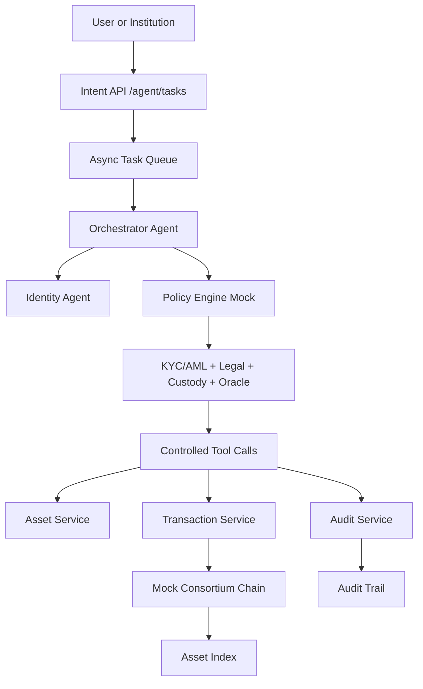

# Runnable MVP

This MVP runs the minimum competition-demo chain:

```text
POST /agent/tasks
  -> Orchestrator Agent
  -> async task queue
  -> Identity Agent
  -> policy mock
  -> KYC/AML + license + legal rights + custody signing + oracle checks
  -> fund share / portfolio equity / compute token operation
  -> mock consortium-chain transaction
  -> audit trail
```

It uses only the Python standard library and SQLite.

## Run The Server

```bash
python3 mvp/app.py --host 127.0.0.1 --port 8080
```

Open the frontend console:

```text
http://127.0.0.1:8080/
```

Health check:

```bash
curl http://127.0.0.1:8080/health
```

## Run The End-To-End Demo

The demo starts a temporary local server and database, then calls the real HTTP API:

```bash
python3 mvp/demo.py
```

Expected flow:

1. Create a `subscribe_fund_share` AgentTask for LP `alice`.
2. Identity, KYC/AML, licensed institution, legal rights, and mock policy approve the task.
3. Custody signing mock signs the transaction payload.
4. Mock chain confirms an `issueFundShareToken` transaction.
5. Asset index contains a `FundShareToken`.
6. Create an `invest_portfolio_equity` AgentTask for GP `issuer_A`.
7. Legal rights and custody signing are recorded as tool calls.
8. Mock chain confirms an `issuePortfolioEquityRWA` transaction.
9. Asset index contains a `PortfolioEquityRWA`.
10. Create a `record_compute_revenue` AgentTask for operator `custodian_A`.
11. Oracle attestation verifies compute units and revenue amount.
12. Mock chain confirms a `recordComputeRevenue` transaction.
13. Asset index contains a `ComputePowerToken`.
14. Audit queries return audit logs, tool calls, transactions, and chain events for all three assets.

## Main Endpoints

```text
POST /agent/tasks
GET  /agent/tasks/{task_id}
GET  /agent/tasks/{task_id}/audit
GET  /assets/{asset_id}
GET  /transactions/{tx_hash}
GET  /audit/assets/{asset_id}
GET  /institutions
POST /institutions
GET  /users
POST /users
GET  /queue/status
GET  /chain/status
GET  /compliance/licenses
GET  /compliance/kyc-aml
GET  /legal/documents
GET  /legal/rights
GET  /legal/rights/{asset_id}
GET  /custody/wallets
GET  /custody/signatures
GET  /oracle/attestations
POST /assets/issue
POST /assets/transfer
POST /admin/reset
```

`POST /assets/issue` and `POST /assets/transfer` are compatibility wrappers. They still create `AgentTask` records and do not bypass policy, mock chain, or audit.

Primary demo intents are:

```text
subscribe_fund_share       -> FundShareToken
invest_portfolio_equity    -> PortfolioEquityRWA
record_compute_revenue     -> ComputePowerToken
```

## Frontend Console

The frontend is served from `mvp/static/` by the same Python backend. It provides:

- institution and user identity model display;
- compliance, legal rights, custody, and oracle control display;
- LP fund-share subscription form;
- GP portfolio-equity investment form;
- compute-token revenue audit form;
- current asset state panel;
- recent AgentTask list;
- audit log, tool-call, and chain-event timelines;
- reset and refresh controls.

## Architecture



## Design Limits

- This is an in-process asynchronous MVP, not the final distributed service architecture.
- The task API is asynchronous, but worker execution is still an in-process MVP worker.
- Default chain adapter is deterministic local mock state, not a real validator network.
- Policy engine is a simple rule mock.
- KYC/AML, licensed-institution, legal rights, custody signing, and oracle records are demo data and replaceable adapters.
- Transfer supports full-balance transfer only.
- The implementation is intentionally compact so the demo path is easy to inspect.

## Chain Adapter

Default mode:

```bash
CHAIN_ADAPTER=mock python3 mvp/app.py
```

External HTTP adapter mode:

```bash
CHAIN_ADAPTER=http CHAIN_RPC_URL=http://127.0.0.1:9000 python3 mvp/app.py
```

The HTTP adapter expects `POST {CHAIN_RPC_URL}/transactions` to return at least:

```json
{
  "tx_hash": "0x...",
  "status": "confirmed",
  "block_height": 1,
  "block_hash": "0x..."
}
```
